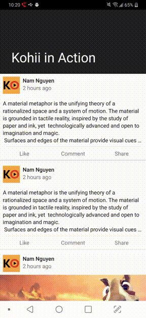

# kohii (コーヒー、[[ko̞ːçiː]](https://en.wiktionary.org/wiki/%E3%82%B3%E3%83%BC%E3%83%92%E3%83%BC))


Video playback for Android made easy.


[](https://www.paypal.me/eneimlabs/500jpy)

Kohii is a high level Video playback library, built from the experience creating/maintaining [toro](https://github.com/eneim/toro) and [ExoPlayer](https://github.com/google/ExoPlayer). Kohii targets directly the Video playback on Android, giving developer powerful playback control, including 

- **(1)** easy way to start a Video playback with confidence (hint: only one line), 
- **(2)** smooth playback experience on ~~list~~ any Views (RecyclerView, NestedScrollView, etc).
- **(3)** smooth transition from local playback to fullscreen playback and vice versa, 

*This library would not deprecate toro anytime soon.*

## Demo

|Automatic playback|Background playback|Playback continuity (Seamless fullscreen)|
| :--- | :--- | :--- |
||||

## Setup

Add to your module's build.gradle dependencies

```groovy
implementation "im.ene.kohii:kohii:1.0.0.2906-A10"
implementation "com.google.android.exoplayer:exoplayer:2.9.6"
```

## Start a playback

```kotlin
// have a videoUrl first.
// TODO other initializations
Kohii[fragment].setUp(videoUrl).bind(playerView)
```
