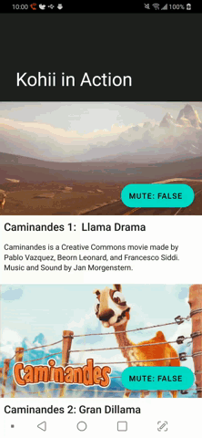

# Kohii

## kohii (コーヒー、[[ko̞ːçiː]](https://en.wiktionary.org/wiki/%E3%82%B3%E3%83%BC%E3%83%92%E3%83%BC))


Video playback for Android made easy.


[](https://github.com/sponsors/eneim)

Kohii is a high level Video playback library, built from the experience creating/maintaining [toro](https://github.com/eneim/toro) and [ExoPlayer](https://github.com/google/ExoPlayer). Kohii targets directly the Video playback on Android, giving developer powerful playback control, including 

- **(1)** easy way to start a Video playback with confidence (hint: only one line), 
- **(2)** smooth playback experience on ~~list~~ any Views (RecyclerView, NestedScrollView, etc).
- **(3)** smooth transition from local playback to fullscreen playback and vice versa, 

*This library would not deprecate toro anytime soon.*

## Demo

|Automatic playback|Playback continuity (Seamless fullscreen)|
| :--- | :--- |
|||

## Setup

Add to your module's build.gradle dependencies

```groovy
// Update top level build.gradle
allprojects {
  repositories {
    // ⬆ Other repositories
    // Add this one below:
    maven { url 'https://oss.sonatype.org/content/repositories/snapshots' }
  }
}
```

```groovy
// Add these to app level build.gradle (or to module that will use Kohii)
implementation "im.ene.kohii:kohii:1.0.0.2010004-A11"
implementation "com.google.android.exoplayer:exoplayer:2.10.4"
```

## Start a playback

```kotlin
// TODO: Have a videoUrl first.
// 1. Initialization
// Obtain global instance of Kohii
val kohii = Kohii[this].also {
  // Register the ViewGroup whose scroll will affect the Playback status.
  // App developer must be aware of this ViewGroup and decide by yourself.
  it.register(this, this.recyclerView)
 }

// 2. Now bind the video to the PlayerView inside ViewGroup above (PlayerView must be the ViewGroup's descendant).  
kohii.setUp(videoUrl).bind(playerView)
```
